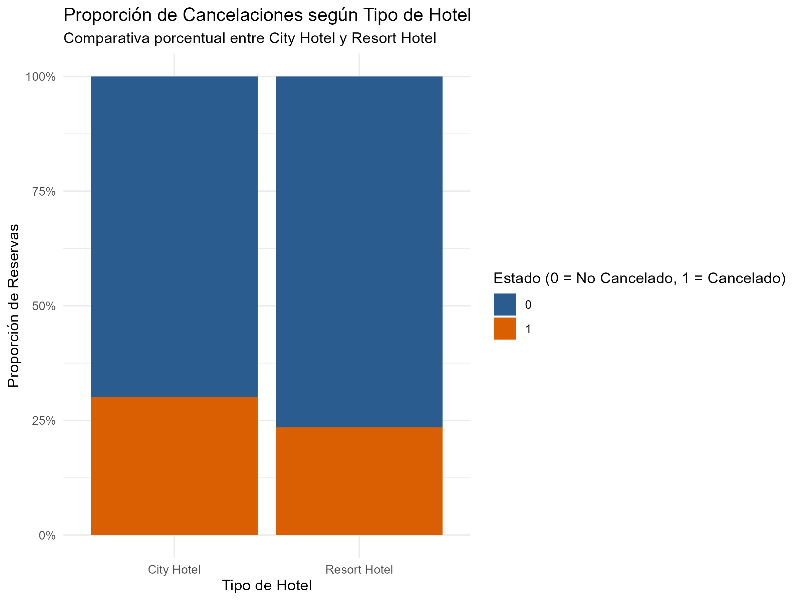
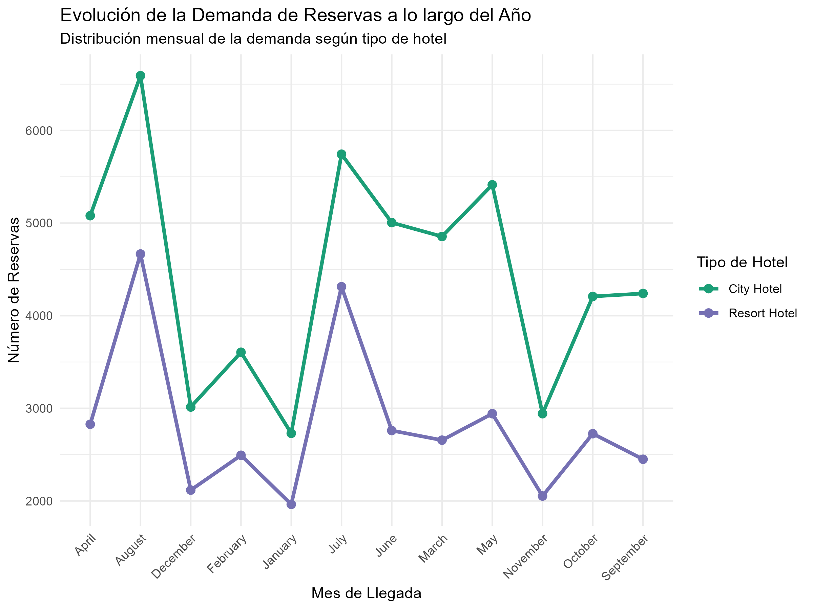

# TB1 – Análisis exploratorio, visualización y comunicación de datos: Hotel Booking Demand

**Universidad Peruana de Ciencias Aplicadas (UPC) · Facultad de Ingeniería**
Curso: 1ACC0216 – Fundamentos de Data Science · NRC 4879 · Ciclo 2026-02
Profesora: Nérida Isabel Manrique Tunque · Grupo 01

---s

## 1. Objetivo del trabajo

Transformar los registros de reservas de dos hoteles (un hotel urbano, *City Hotel*, y un hotel vacacional, *Resort Hotel*) en información útil para la toma de decisiones. Para ello se evalúa la calidad del dataset, se prepara una versión depurada y se responden dos preguntas de negocio mediante análisis exploratorio y visualización en **R**:

1. ¿Qué proporción de las reservas corresponde a cada tipo de hotel y qué porcentaje de estas termina en cancelación?
2. ¿Qué meses presentan mayor y menor cantidad de reservas en cada tipo de hotel y cómo evoluciona la demanda durante el año?

## 2. Integrantes

| Nombres y apellidos | Código |
|---|---|
| Addy Valentina Pinedo Saldaña | U20241D259 |
| Edson Jair Ramos Vásquez | U20241F442 |
| Jack Snayder Lima Huamani | U20241G263 |
| Noelia Paquiyauri Tumbay | U20241F592 |
| Tony Montesinos Condori | U20241F805 |

## 3. Descripción del dataset

**Hotel Booking Demand** (Antonio, Almeida & Nunes, 2019) contiene **119 390 registros y 32 variables** de reservas realizadas en dos hoteles entre **julio de 2015 y agosto de 2017**. Incluye el estado final de la reserva, la anticipación (`lead_time`), la fecha de llegada, la duración de la estancia (noches de semana y fin de semana), la composición del grupo (`adults`, `children`, `babies`), el país de origen, el segmento y canal de distribución, la política de depósito, la tarifa diaria promedio (`adr`), entre otras.

El dataset original presenta problemas de calidad que se trataron en este trabajo:

| Problema detectado | Magnitud | Tratamiento |
|---|---|---|
| Valores faltantes | `company` 94.3 %, `agent` 13.7 %, `country` 0.409 %, `children` 0.003 % | Estandarización a `NA` en la importación |
| Filas duplicadas exactas | 31 994 (26.80 %) | Se conserva un único registro (`distinct()`) |
| Tarifa diaria inválida (`adr`) | Valores de -6.38 y 5 400 | Exclusión de los registros |
| Categorías `Undefined` | `meal`, `market_segment`, `distribution_channel` | Recodificación a `NA` |
| Tipos de dato inadecuados | Variables categóricas y de fecha leídas como texto | Conversión a `factor` y `Date` |
| Composición de huéspedes dudosa | 223 reservas con menores sin adultos; 180 con 0 huéspedes | Marcadas para revisión, sin modificar |

Tras la preparación, el dataset pasa de 119 390 a **87 394 registros** (87 396 únicos menos 2 por `adr` inválido). El archivo original se mantiene sin modificaciones.

> **Fuente:** Antonio, N., Almeida, A., & Nunes, L. (2019). Hotel booking demand datasets. *Data in Brief, 22*, 41-49. <https://doi.org/10.1016/j.dib.2018.11.126>

## 4. Estructura del repositorio

```
1ACC0216-TB1-2026-2-grupo01/
├── README.md
├── LICENSE
├── data/
│   ├── hotel_bookings_original.csv     # datos crudos, sin modificar
│   └── hotel_bookings_preparado.csv    # datos depurados
├── code/
│   └── upc-grupo01-tb1-codigo.R        # script completo del análisis
└── output/
    └── graficos/                       # figuras generadas (PNG)
```

## 5. Cómo reproducir el análisis

1. Clonar o descargar este repositorio.
2. Abrir R/RStudio y establecer como directorio de trabajo la **carpeta raíz** del repositorio, por ejemplo: `setwd("ruta/a/1ACC0216-TB1-2026-2-grupo01")`.
3. Instalar los paquetes requeridos (una sola vez):
   ```r
   install.packages(c("tidyverse", "lubridate", "moments", "scales"))
   ```
4. Ejecutar `code/upc-grupo01-tb1-codigo.R`. El script lee `data/hotel_bookings_original.csv` y genera `data/hotel_bookings_preparado.csv`.

## 6. Resultados principales

### Reservas y cancelaciones por tipo de hotel



El **City Hotel** concentra el **61.1 %** de las reservas con una tasa de cancelación de **30 %**, mientras que el **Resort Hotel** concentra el **38.9 %** con una cancelación de **22.8 %**.

### Evolución mensual de la demanda



El City Hotel mantiene una demanda sostenida entre mayo y septiembre, con su máximo en agosto. El Resort Hotel presenta una fuerte concentración en el verano (julio y agosto) y cae notablemente en los meses de invierno.

## 7. Conclusiones

- El **City Hotel** concentra el mayor volumen operativo (61.1 % de las reservas), pero enfrenta una alta volatilidad comercial: **30 % de cancelaciones**, frente al 22.8 % del Resort Hotel.
- La demanda de ambos hoteles responde a dinámicas estacionales distintas: el hotel urbano mantiene afluencia sostenida durante gran parte del año, mientras que el **Resort Hotel depende de forma marcada del verano** (julio y agosto) y subutiliza su infraestructura en invierno.
- El dataset original contenía **26.8 % de filas duplicadas** y tarifas diarias inválidas (negativas y extremas). Su depuración fue indispensable para evitar sesgos en los indicadores.
- La combinación de análisis univariado, cruces bivariados de proporciones y visualización temporal permitió responder con evidencia las preguntas de negocio planteadas.

**Recomendaciones**

- *City Hotel:* implementar políticas de depósito, anticipos o tarifas no reembolsables para reducir el abandono de reservas.
- *Resort Hotel:* diseñar campañas de incentivos y convenios corporativos para la temporada baja, de modo que se aproveche mejor la infraestructura durante todo el año.

**Limitación:** el análisis solo abarca datos de 2015 a 2017, por lo que las conclusiones sobre cancelaciones y estacionalidad aplican únicamente a ese periodo.

## 8. Licencia

- **Código y documentación:** [Licencia MIT](LICENSE).
- **Datos:** el dataset *Hotel Booking Demand* pertenece a sus autores originales (Antonio, Almeida & Nunes, 2019) y se distribuye bajo licencia [Creative Commons Attribution 4.0 (CC BY 4.0)](https://creativecommons.org/licenses/by/4.0/). Se incluye aquí con fines académicos, con la atribución correspondiente.
